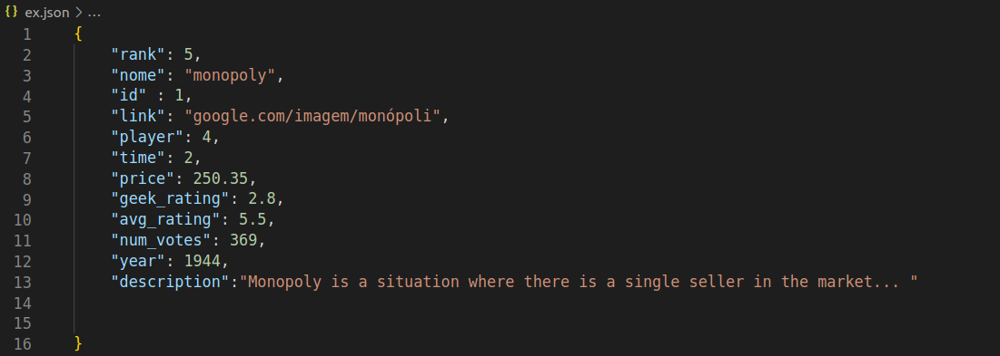

# Projeto 3 - TecWeb
## API:

  
O Django irá auxiliar para o tratamento de dados contendo as seguintes informações salvas em um banco de dados interno como END points, e retorna-os em um .JSON:

  
  | Endpoint | Descrição | 
  |-----------|:-----------:|
| rank | Jogos listados pela avaliação de jogadores| 
| name | nome do jogo | string |
| year | Ano de fabricação | 
| time | Tempo de partida | 
| price | Preço do jogo | 
| players | Quantidade máxima de jogadores | 
| category | Estilo do jogo | 
| random | Escolhe um jogo aleatório | 

  - Ranqueamento, o usuário poderá filtrar os jogos de acordo com a avaliação de outros jogadores.
  - Ranqueamento/Posição na classificação(número inteiro), irá apresentar o jogo que possuí a posição do número inteiro no ranque.
  - Nome, filtra os jogos pelo nome.
  - Ano, filtra os jogos pelo ano de criação.
  - Tempo, filtra os jogos pelo tempo médio de uma partida.
  - Preço, filtra os jogos pelo preço.
  - Número de jogadores, filtra os jogos pela quantidade de jogadores.
  - Categoria, filtra os jogos pelo tipo de jogo.
  - Random, irá entregar um jogo aleatório para o usuário.

 No caso do acesso aos itens no JSON, os dados serão apresentados dessa forma:

| Info | Descrição | Tipo|
|-----------|:-----------:|-----------:| 
| rank | Ranque do jogo | integer | 
|id| Número de identificação | integer|
| name | Nome do jogo | string |
| link | Link da foto | string |
| player | Quantidade de jogadores | integer |
| time | Duração média de uma partida | integer |
| price | Preço do jogo(se disponível) | float |
| geek_rating | Categoria de 0 a 10 | float |
| avg_rating | Categoria de 0 a 10 | float |
| num_votes | Quantidade de pessoas que votaram |integer |
| year | Ano de criação | integer |
| descrip | Descrição do jogo | string |

